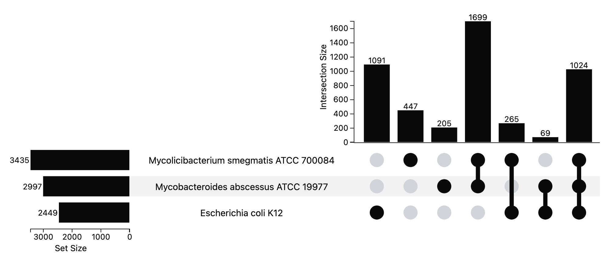
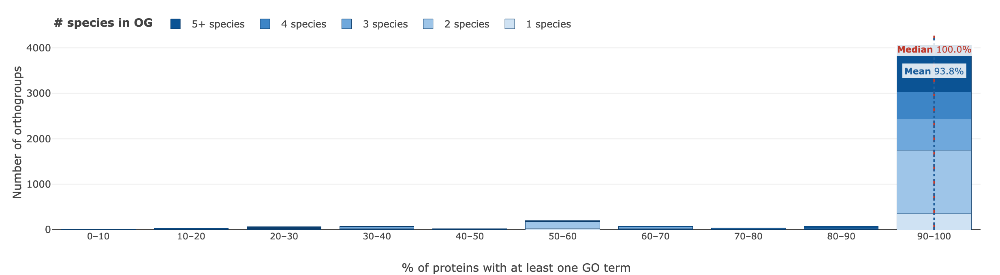
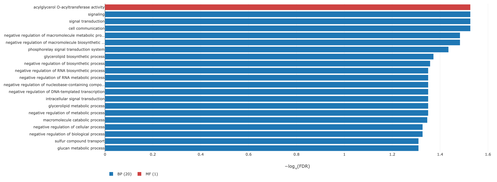

# 🧬 OrthoGather

**A local web application that pairs orthology inference with Gene Ontology enrichment, for proteomes that are not well annotated.**

[](https://doi.org/10.5281/zenodo.18510911)


Download **UniProt** proteomes, run **OrthoFinder**, explore orthogroups across species, and test
Gene Ontology enrichment with **GOATOOLS** — in one interface, on your own machine, with every
figure and table exportable.

<p align="center">
  
</p>

---

## What it does

- **Retrieves proteomes.** Search 1,013,422 UniProt proteomes by scientific name, common name,
  taxonomic synonym, abbreviated binomial or proteome ID, and stream them as FASTA.
- **Infers orthogroups.** Runs OrthoFinder 2.5.5 locally with live logs, keeping only the
  `Orthogroups` output so the workspace stays small.
- **Compares species.** Interactive UpSet plots of orthogroup and protein intersections, filterable
  by a list of UniProt identifiers of your own.
- **Tests function.** GO over-representation with a one-sided Fisher exact test and
  Benjamini–Hochberg correction, with an option to widen each protein set to the orthogroups that
  contain it — so annotations that already exist on well-annotated orthologues can contribute
  evidence for the species you actually care about.

> **What this is not.** Orthogroup expansion pools *existing* annotations for the purpose of the
> enrichment test. No annotation is ever transferred to, or written onto, an individual protein.
> OrthoGather does not perform phylogeny-based annotation propagation.

<p align="center">
  
  <br><sub>Live search over the full UniProt proteome catalogue, then OrthoFinder runs locally.</sub>
</p>

---

## What it produces

Every figure below was exported by the application itself, from the worked example in
[`example_analysis/`](example_analysis/). Nothing was redrawn by hand.

<p align="center">
  
  <br><sub><b>Orthogroup intersections.</b> Hovering an intersection highlights it and reports its members.
  Intersections are exclusive: each orthogroup is counted once.</sub>
</p>

<p align="center">
  
  <br><sub><b>Annotation coverage.</b> How much of each orthogroup carries a GO term, before any test is run —
  a quick check of whether adding a better-annotated species would help.</sub>
</p>

<p align="center">
  
  <br><sub><b>Enrichment.</b> Bars are −log₁₀(FDR), coloured by namespace. Terms above the significance
  threshold but below a looser display threshold are drawn hollow, so near misses are visible without
  being counted as findings.</sub>
</p>

Each figure comes with its data in XLSX, CSV, TSV and JSON, and each chart exports as PNG and SVG.

---

## Worked example

[`example_analysis/`](example_analysis/) holds a complete run, start to finish, of the example
published with the manuscript: six bacterial species, the 491 proteins reported as differentially
abundant in *Mycolicibacterium smegmatis* under sub-lethal rifampicin
([Giddey *et al.* 2017](https://doi.org/10.1038/srep43858)), split by direction of change and
tested against the 3,181 proteins detected in that study.

| | |
|---|---|
| [`0_run_metadata/`](example_analysis/0_run_metadata/) | software and database versions, a citation for this exact run, the taxonomic tree |
| [`1_orthofinder/`](example_analysis/1_orthofinder/) | the OrthoFinder output — 5,949 orthogroups |
| [`2_comparative_analysis/`](example_analysis/2_comparative_analysis/) | six figures, each as PNG, SVG, XLSX, CSV, TSV and JSON |
| [`3_go_annotation/`](example_analysis/3_go_annotation/) | GO coverage per orthogroup — 4,638 of 5,949 carry at least one annotated protein |
| [`4_go_enrichment/`](example_analysis/4_go_enrichment/) | one folder per direction of change, with chart, full results and results table |
| [`input_dataset/`](example_analysis/input_dataset/) | the exact identifier lists, ready to paste back in |

Every file there is the application's own export. Paste the lists from `input_dataset/` into a fresh
install and you should reproduce the run — see the [README in that folder](example_analysis/README.md)
for the versions used, since the EBI GOA repository is refreshed monthly.

---

## Reproducibility

Every analysis records what produced it. The Summary panel and every exported workbook carry a
provenance block: OrthoGather version, OrthoFinder version, GOATOOLS version, the UniProt release and
proteome-catalogue version, the Gene Ontology release, the date the GOA files were generated at the
EBI, and every statistical parameter of the run — evidence codes kept, counting mode, test tail, FDR
method and scope, propagation relations, term-size bounds, and the size of the correction family.

It exports as text or JSON, and the Analysis History lets you browse, reload, compare and cite past
runs, with BibTeX and RIS for each.

---

## Download and installation

### ⚡ Easiest: one-click installer (no terminal)

For non-technical users — download the installer for your computer, double-click,
and it sets up **everything** (package manager, the app, Python 3.11, OrthoFinder)
and adds an **OrthoGather** launcher to your Desktop:

- **macOS** (Apple Silicon & Intel): `Install OrthoGather.command`
- **Windows 10/11**: `Install OrthoGather.bat` (enables WSL automatically — OrthoFinder
  has no native Windows build; needs admin + one restart, then continues by itself)

Get them from the [Releases page](https://github.com/CarlosVivasR/OrthoGather/releases).
See [`installers/`](installers/) for details. The manual conda route below still works
for advanced users.

### Prerequisites

- **Git** (a plain clone is enough — **no Git LFS required**)
- **Conda** or **Micromamba**
- A Unix-based environment (macOS, Linux, or WSL)

> The proteome catalogue ships compressed inside the repo
> (`static/Proteomes_json/proteomes_list.json.gz`, ~19 MB) and is unpacked
> automatically on the first launch. The app also checks GitHub for a newer
> catalogue and offers a one-click update.

### Clone the repository

```bash
git clone https://github.com/CarlosVivasR/OrthoGather.git
cd OrthoGather
```

### ✅ Recommended: one-line install with Conda (all platforms)

The canonical setup is a single Conda environment defined in [`environment.yml`](environment.yml).
It installs Python 3.11, OrthoFinder 2.5.5, and every Python dependency — and runs
**natively** on Apple Silicon, Intel macOS, Linux, and WSL (no Rosetta).

```bash
conda env create -f environment.yml
conda activate orthogather
python app.py
```

That's it. Every time you want to use OrthoGather, just `conda activate orthogather` and `python app.py`.

> Using **Micromamba** instead of Conda? Replace `conda` with `micromamba` in the commands above.

### 🧩 Optional: guided install scripts

```bash
./installers/install_orthogather_mac.sh   # macOS (Apple Silicon or Intel)
./installers/install_orthogather_wsl.sh   # Linux / WSL
```

Both scripts create the same `orthogather` environment from `environment.yml` and verify that
OrthoFinder is detected.

⚠️ **Prerequisite:** Conda or Micromamba must already be installed (e.g. via
[Miniforge](https://github.com/conda-forge/miniforge)). For a step-by-step walkthrough and
troubleshooting, see [Installation_guide.pdf](docs/Installation_guide.pdf).

---

## Input modes

| Mode | Use it when |
|---|---|
| **New Analysis** | You want to pick species from UniProt and run OrthoFinder yourself. |
| **Preselected Dataset** | You want to try the platform immediately: 47 proteomes from 35 species across 19 genera associated with cystic fibrosis infection and antimicrobial resistance, shipped with the app. |
| **External Data Upload** | You already have OrthoFinder results, or orthology relationships in OrthoXML, and want to reuse them. |

Whichever you choose, everything downstream works from the standard `Orthogroups` output.

**OrthoFinder threads.** OrthoGather calls OrthoFinder with `-og` — which stops after orthogroup
clustering and skips gene-tree and pairwise-ortholog inference — and auto-detects your CPU count for
`-t` and `-a`. On a 10-core Mac you get `-t 10 -a 2`; on a 4-core laptop, `-t 4 -a 1`. Both are
overridable if you want to leave headroom.

---

## Analysis routes

### 1. Comparative Orthogroup Analysis

Select two or more species and get UpSet plots of orthogroup and protein intersections. Narrow
further with your own list of UniProt identifiers: OrthoGather reports which of them mapped, which
are in the proteomes but were left unassigned by OrthoFinder, and which are absent altogether, then
redraws the plots over the orthogroups that survive.

### 2. Gene Ontology Enrichment

OrthoGather matches each species to its GOA file at the EBI, reports annotation coverage per
orthogroup, and then tests a foreground against a background.

The test is a one-sided Fisher exact test for over-representation. Annotations are propagated to
parent terms over `is_a` and `part_of` (the True Path Rule); annotations carrying the `NOT`
qualifier are discarded; terms annotating fewer than 10 or more than 500 proteins of the annotated
background are removed before correction; and Benjamini–Hochberg is then applied once across the
three namespaces, which share a single annotated reference universe. Both the foreground and the
background are restricted to annotated proteins, so the two denominators always match.

Adjustable without re-running the analysis: FDR threshold, minimum GO depth, maximum terms per
namespace, and a separate display threshold that draws near-significant terms as hollow bars.
Adjustable per run: evidence-code stringency (all, non-IEA, or experimental only), all orthogroups
or single-copy only, and counting per protein or per orthogroup.

---

## Errors

OrthoGather has a single error catalogue instead of stack traces: every failure gets a stable code,
a message in plain language, and a hint saying what to do about it. A missing ontology file, a
foreground that does not overlap the background, a species with no GOA file, an OrthoFinder run that
dies for lack of memory — each one tells you what happened and where to look.

---

## Tests

```bash
conda activate orthogather
python -m pytest -q
```

101 tests covering the catalogue, orthogroup parsing, the GO pipeline, the export formats and the
error catalogue.

---

## Citation

If you use OrthoGather, please cite the software through its Zenodo record (see the DOI badge at the
top of this page). The `CITATION.cff` in this repository is picked up by GitHub's *Cite this
repository* button and by most reference managers.

> Manuscript under review. This section will be updated with the journal reference once available.

---

## Built on

- [OrthoFinder](https://github.com/davidemms/OrthoFinder) — orthogroup inference
- [GOATOOLS](https://github.com/tanghaibao/goatools) — Gene Ontology analysis
- [UniProt](https://www.uniprot.org/) — reference proteomes and the proteome catalogue
- [EBI GOA](https://www.ebi.ac.uk/GOA/) — Gene Ontology annotation files
- [Gene Ontology](http://geneontology.org/) — the ontology itself
- [UpSet](https://upset.app/) — set-intersection visualisation
- [Plotly.js](https://plotly.com/javascript/) — interactive charts

## Licence

GPLv3 — see [LICENSE](LICENSE).
