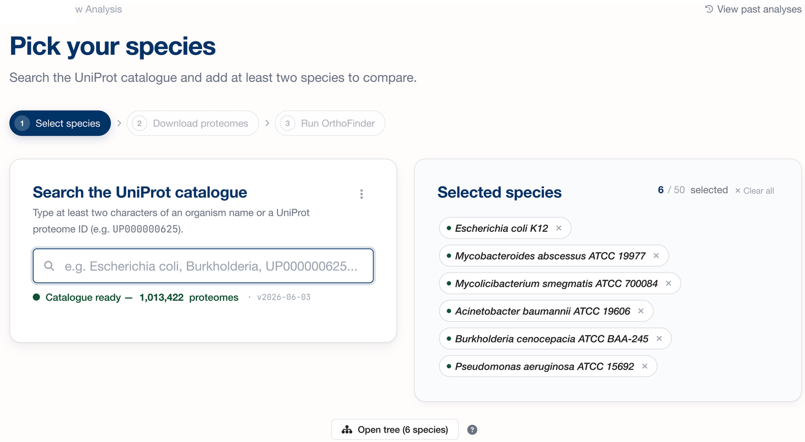
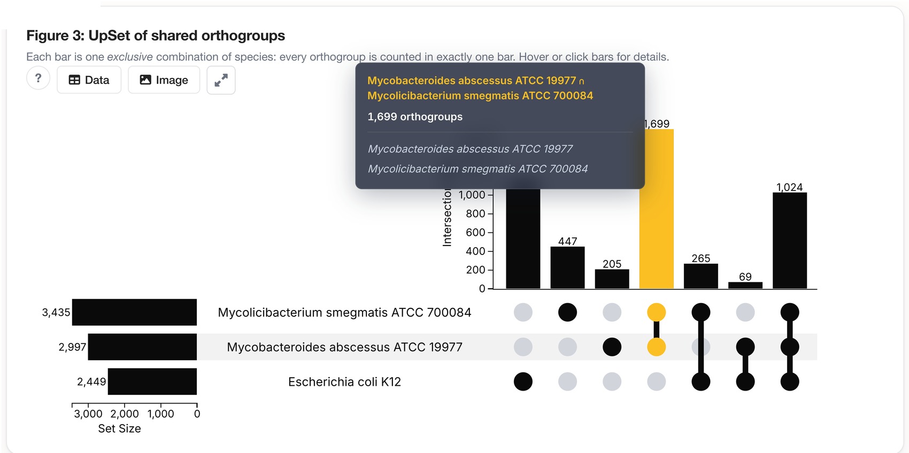
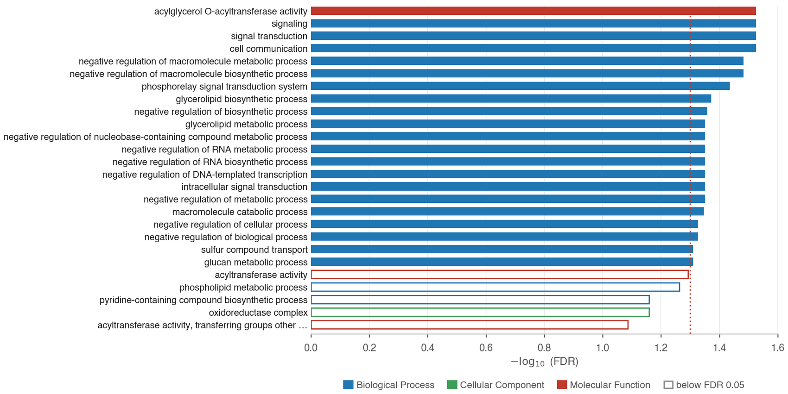
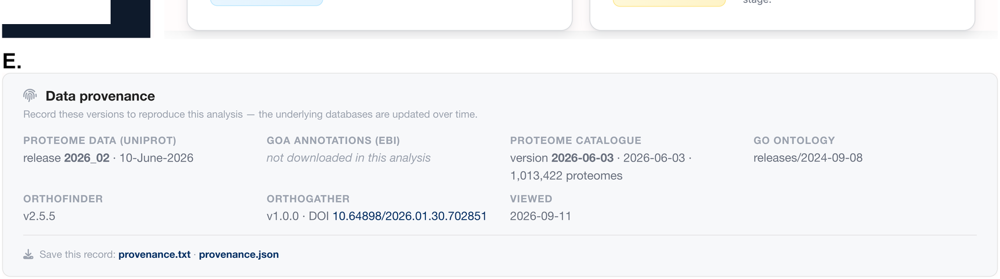
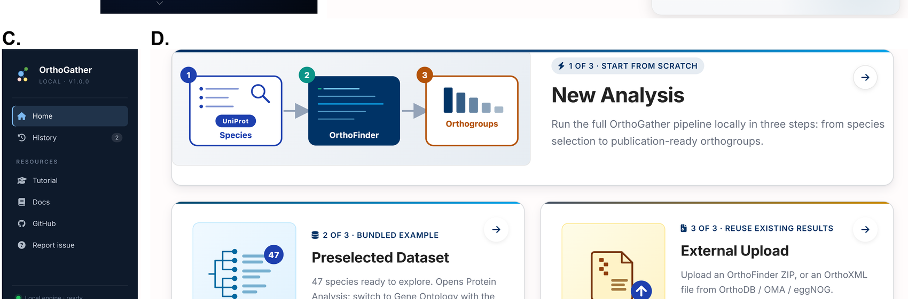

# OrthoGather

**Compare proteomes and test Gene Ontology enrichment, without the command line.**

[](https://doi.org/10.5281/zenodo.18510911)


<p align="center">
  
</p>
<p align="center"><i>Search 1,013,422 UniProt proteomes, pick your species, and OrthoFinder runs on your own machine.</i></p>

OrthoGather is a web application you run locally. It downloads reference proteomes from UniProt,
infers orthogroups with **OrthoFinder**, lets you explore which orthogroups species share, and tests
Gene Ontology over-representation with **GOATOOLS** — with every figure and table exportable, and a
provenance record attached to each run.

**28,475** of those proteomes have Gene Ontology annotations at the EBI, which is what decides
whether your organism can be taken through the enrichment step.

```bash
git clone https://github.com/CarlosVivasR/OrthoGather.git && cd OrthoGather
conda env create -f environment.yml
conda activate orthogather
python app.py
```

Prefer not to touch a terminal? There is a double-click installer for macOS and Windows on the
[Releases page](https://github.com/CarlosVivasR/OrthoGather/releases).

---

## Is this the right tool for you?

**Yes, if** you have a list of proteins from a differential experiment, you want to know which of
them have counterparts in other species, and your organism is not well annotated.

**Probably not, if:**

1. You need hierarchical orthologous groups, gene trees or dated phylogenies. OrthoGather runs
   OrthoFinder with `-og`, which stops after orthogroup clustering — see
   [OMA](https://omabrowser.org), [OrthoDB](https://www.orthodb.org) or
   [OrthoFinder](https://github.com/davidemms/OrthoFinder) run in full.
2. You are working at the scale of hundreds of proteomes. This is built for focused comparisons of
   a handful of species; OrthoFinder inference is the bottleneck.
3. Your species has no GOA file at the EBI. It will still take part in the orthogroup analysis, but
   it cannot contribute annotations to the enrichment.
4. You want annotations *assigned* to your unannotated proteins. OrthoGather never writes an
   annotation onto a protein — see [What orthogroup expansion does](#what-orthogroup-expansion-does).

---

## What it produces

### Which orthogroups your species share

<p align="center">
  
</p>
<p align="center"><i>Intersections are exclusive — every orthogroup is counted in exactly one bar. Hovering highlights the bar and names its members.</i></p>

Narrow the plots to your own list of UniProt identifiers and OrthoGather tells you which of them
mapped, which are in the proteomes but were left unassigned by OrthoFinder, and which are absent
altogether.

### Which functions are over-represented

<p align="center">
  
</p>
<p align="center"><i>Bars are −log₁₀(FDR), coloured by namespace. Hollow bars fall below the significance threshold but above a looser display threshold: they are shown for context, and are not findings.</i></p>

A one-sided Fisher exact test with Benjamini–Hochberg correction, and an interactive table you can
filter by namespace, evidence code, FDR and ontology depth, then export.

### A record of how you got there

<p align="center">
  
</p>
<p align="center"><i>Every run records the versions behind it, exportable as text or JSON. The Analysis History lets you reload, compare and cite past runs.</i></p>

---

## What orthogroup expansion does

Both the foreground and the background can be widened to the full orthogroups that contain them.
Annotations that already exist on well-annotated orthologues then count towards the enrichment
test, which is what makes the method useful for a poorly annotated organism.

> [!IMPORTANT]
> Expansion pools *existing* annotations for the purpose of the test. No annotation is transferred
> to, or written onto, any individual protein, and OrthoGather does not perform phylogeny-based
> annotation propagation such as PAINT.

---

## Installation

### Double-click installer

Download for your platform from the [Releases page](https://github.com/CarlosVivasR/OrthoGather/releases).
It installs the package manager, Python 3.11, OrthoFinder and the application, and puts a launcher
on your Desktop.

- **macOS** (Apple Silicon and Intel): `Install OrthoGather.command`
- **Windows 10/11**: `Install OrthoGather.bat` — enables WSL automatically, since OrthoFinder has no
  native Windows build. Needs administrator rights and one restart, then continues on its own.

### Conda

Requires Git, Conda or Micromamba, and a Unix-like environment (macOS, Linux or WSL).

```bash
git clone https://github.com/CarlosVivasR/OrthoGather.git && cd OrthoGather
conda env create -f environment.yml
conda activate orthogather
python app.py
```

The environment brings Python 3.11, OrthoFinder 2.5.5 and every dependency, and runs natively on
Apple Silicon, Intel macOS, Linux and WSL — no Rosetta. Replace `conda` with `micromamba` if that is
what you have.

> [!NOTE]
> **Disk.** The proteome catalogue ships compressed (20 MB) and is unpacked on first launch to a
> **260 MB** JSON. With the ontology and the repository, budget around 350 MB before any analysis,
> plus whatever the proteomes you download need.

<details>
<summary>Guided install scripts, and the step-by-step guide</summary>

```bash
./installers/install_orthogather_mac.sh   # macOS (Apple Silicon or Intel)
./installers/install_orthogather_wsl.sh   # Linux / WSL
```

Both create the same `orthogather` environment from `environment.yml` and check that OrthoFinder is
detected. Conda or Micromamba must already be installed — for example via
[Miniforge](https://github.com/conda-forge/miniforge).

For a walkthrough with screenshots and troubleshooting, see
[Installation_guide.pdf](docs/Installation_guide.pdf).
</details>

---

## Three ways in

<p align="center">
  
</p>

| Mode | Use it when |
|---|---|
| **New Analysis** | You want to pick species from UniProt and run OrthoFinder yourself. |
| **Preselected Dataset** | You want to try it straight away: 47 proteomes from 35 species across 19 genera associated with cystic fibrosis infection and antimicrobial resistance, shipped with the app. |
| **External Upload** | You already have OrthoFinder results, or orthology relationships in OrthoXML, and want to reuse them. |

Whichever you choose, everything downstream works from the standard `Orthogroups` output.

---

## Worked example

[`example_analysis/`](example_analysis/) is a complete run of the example published with the
manuscript: six bacterial species, and the 491 proteins reported as differentially abundant in
*Mycolicibacterium smegmatis* under sub-lethal rifampicin
([Giddey *et al.* 2017](https://doi.org/10.1038/srep43858)), split by direction of change and tested
against the 3,181 proteins detected in that study.

| Folder | Contents |
|---|---|
| [`0_run_metadata/`](example_analysis/0_run_metadata/) | software and database versions, a citation for this exact run, the taxonomic tree |
| [`1_orthofinder/`](example_analysis/1_orthofinder/) | the OrthoFinder output — 5,949 orthogroups |
| [`2_comparative_analysis/`](example_analysis/2_comparative_analysis/) | six figures, each as PNG, SVG, XLSX, CSV, TSV and JSON |
| [`3_go_annotation/`](example_analysis/3_go_annotation/) | GO coverage per orthogroup — 4,638 of 5,949 carry at least one annotated protein |
| [`4_go_enrichment/`](example_analysis/4_go_enrichment/) | one folder per direction of change, with chart, full results and results table |
| [`input_dataset/`](example_analysis/input_dataset/) | the exact identifier lists, ready to paste back in |

Every file there is the application's own export. Paste the lists from `input_dataset/` into a fresh
install and you should reproduce the run — see the
[README in that folder](example_analysis/README.md) for the exact versions, since the EBI GOA
repository is refreshed monthly.

---

## How the enrichment works

- **Test** — one-sided Fisher exact test for over-representation.
- **Propagation** — annotations are propagated to parent terms over `is_a` and `part_of`
  (the True Path Rule); `regulates` relations are not traversed.
- **Qualifiers** — annotations carrying `NOT` are discarded.
- **Term size** — terms annotating fewer than 10 or more than 500 proteins of the annotated
  background are removed before correction.
- **Correction** — Benjamini–Hochberg, applied once across the three namespaces, which share a
  single annotated reference universe.
- **Denominators** — foreground and background are both restricted to annotated proteins, so the two
  always match.

Adjustable without re-running: FDR threshold, minimum GO depth, maximum terms per namespace, and the
display threshold. Adjustable per run: evidence-code stringency (all, non-IEA, or experimental
only), all orthogroups or single-copy only, and counting per protein or per orthogroup.

---

## When something goes wrong

OrthoGather has an error catalogue rather than stack traces. Every failure gets a stable code, a
message in plain language and a hint saying what to do — a missing ontology file, a foreground that
does not overlap the background, a species with no GOA file, an OrthoFinder run that runs out of
memory.

Found a bug, or want something it does not do? Open an
[issue](https://github.com/CarlosVivasR/OrthoGather/issues) — there are templates for both.

---

## Tests

```bash
conda activate orthogather
python -m pytest -q
```

101 tests covering the catalogue, orthogroup parsing, the GO pipeline, the export formats and the
error catalogue.

---

## Citation

Cite the software through its Zenodo record — the DOI badge at the top of this page. GitHub's
*Cite this repository* button reads [`CITATION.cff`](CITATION.cff) and will give you the entry in
your preferred format.

> The manuscript describing OrthoGather is under review. This section will carry the journal
> reference once it is available.

If you use the enrichment module, please also cite **OrthoFinder** and **GOATOOLS** — OrthoGather
orchestrates them, it does not replace them.

---

## Built on

[OrthoFinder](https://github.com/davidemms/OrthoFinder) · [GOATOOLS](https://github.com/tanghaibao/goatools) ·
[UniProt](https://www.uniprot.org/) · [EBI GOA](https://www.ebi.ac.uk/GOA/) ·
[Gene Ontology](http://geneontology.org/) · [UpSet](https://upset.app/) ·
[Plotly.js](https://plotly.com/javascript/)

## Licence

GPLv3 — see [LICENSE](LICENSE).
