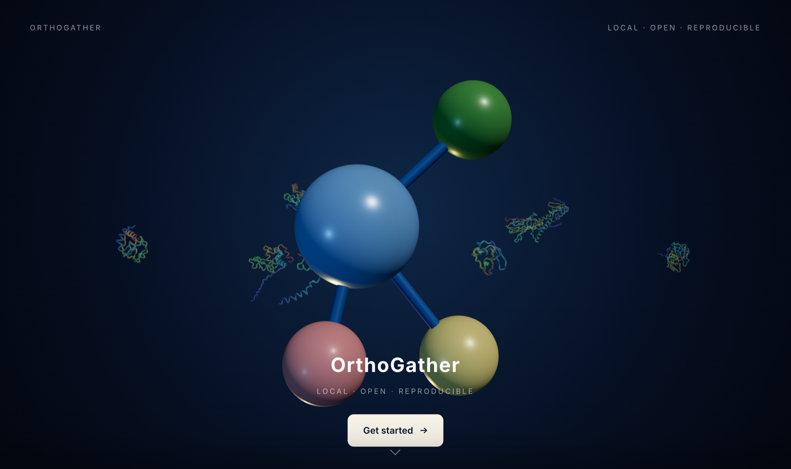
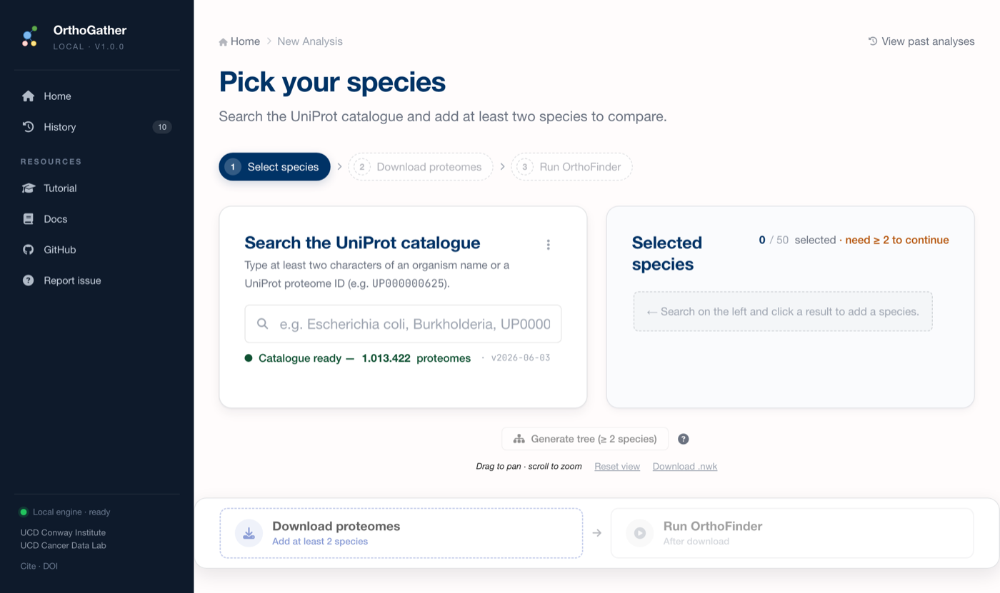

# 🧬 OrthoGather: a local platform for orthology-based proteome comparison and Gene Ontology enrichment

[](https://doi.org/10.5281/zenodo.18510911)


**OrthoGather** — compare proteomes with **OrthoFinder** and discover function with **GOATOOLS** — all in a local web application.  
Download **UniProt** proteomes, run **OrthoFinder**, perform **Gene Ontology enrichment**, and export publication-ready figures and tables.  
*Requires Python 3.11 and OrthoFinder 2.5.5 (runs natively on Apple Silicon, Intel macOS, Linux, and WSL — no Rosetta needed).*

<p align="center">
  
</p>

---

## 🧩 Overview

You have a list of proteins from an experiment — differentially abundant, co-purified, whatever your
assay produced — in an organism whose proteins are largely annotated as "uncharacterised". You want to
know what those proteins do, and which of them have counterparts in the other species you
care about.

**OrthoGather** answers both questions from one starting point. It fetches proteomes from UniProt —
reference and non-reference alike — runs **OrthoFinder** to cluster every protein into **orthogroups** — the proteins descended from a
single gene in the last common ancestor *of the species you included*, so adding or removing a
species redraws them — and from that single structure gives you two things: a comparison of which
orthogroups your species share, and a Gene Ontology enrichment test in which the annotations that
already exist on better-annotated orthologues can be counted.

All analyses run **locally**, favouring **privacy**, **reproducibility**, and **rapid iteration**, and are particularly useful when working with **poorly annotated or non-model organisms**.

<p align="center">
  
  <br><sub>Pick species from the <b>1,013,422-proteome</b> UniProt catalogue with live search, then run OrthoFinder locally.</sub>
</p>

---

## 💡 Why it helps

A substantial fraction of proteins across organisms remain **under-annotated or inconsistently annotated**, which complicates functional interpretation and cross-species comparisons. This is particularly limiting in proteomics experiments involving non-model species or clinical isolates. Run a standard enrichment test on such a species and most of your proteins simply fall out of the analysis: they carry no GO term, so they cannot contribute to it.

**Orthogroups give those proteins a way back in.** If a protein of yours sits in the same orthogroup as a characterised protein from *E. coli*, that orthogroup carries evidence even when your protein does not. OrthoGather lets you widen both the foreground and the background to whole orthogroups, so those existing annotations count towards the test. The enrichment then describes the orthogroups your proteins belong to, rather than only the minority that happen to be annotated.

> **What this is not.** The pooling happens inside the test and nowhere else. No annotation is ever written onto a protein, no function is assigned to anything that lacked one, and OrthoGather does not perform phylogeny-based annotation propagation such as PAINT. It changes which annotations the test counts, on both sides of the table. It is not an annotation
method.

The trade-off is yours to make: expanding brings in evidence from species other than the one you
studied, which broadens the functional context at the cost of the species-specific signal. Run it
both ways and say in your methods which one you report — the exported provenance sheet records the
evidence codes, the counting mode and both denominators, but not the expansion setting.

---

## 📖 Citation

If you use **OrthoGather** in your research, please cite the software through its Zenodo record —
the DOI badge at the top of this page.

> **Manuscript under review.** This section will carry the journal reference once it is available.

Please also cite the resources the analysis rests on: **OrthoFinder**, **GOATOOLS**, the **Gene
Ontology**, the **EBI GOA** database and **UniProt**. OrthoGather orchestrates them and reports what
they produce; it does not replace any of them.

---
## 🔽 Download and Installation

### ⚡ Easiest: one-click installer (no terminal)

For non-technical users — download the installer for your computer, double-click,
and it sets up the package manager, Python 3.11, OrthoFinder and the app,
and adds an **OrthoGather** launcher to your Desktop:

- **macOS** (Apple Silicon & Intel): `Install OrthoGather.command`
- **Windows 10/11**: `Install OrthoGather.bat` (enables WSL automatically — OrthoFinder
  has no native Windows build; needs admin + one restart, then continues by itself)

Get them from the [Releases page](https://github.com/CarlosVivasR/OrthoGather/releases).
See [`installers/`](installers/) for details.

**Which route?** If you are not comfortable in a terminal, use the installer above. Otherwise use
Conda — it is the canonical setup and the one every platform is tested against.

### Prerequisites

Before installing **OrthoGather**, please ensure that you have:

- **Git** (a plain clone is enough — **no Git LFS required**)
- **Conda** or **Micromamba**
- A Unix-based environment (macOS, Linux, or WSL)

> **Disk.** The proteome catalogue ships compressed inside the repo
> (`static/Proteomes_json/proteomes_list.json.gz`, 19 MB) and is unpacked on
> first launch to a **248 MB** JSON. With the ontology and the repository
> itself, budget roughly **350 MB** before any analysis, plus whatever the
> proteomes you download need. The app also checks GitHub for a newer
> catalogue and offers a one-click update.
>
> **Memory.** OrthoFinder inference is the bottleneck and is memory-bound. A multi-core machine with
> **8 GB of RAM or more** handles comparisons of a handful of bacterial proteomes; the six-species
> example completes in about three minutes on an Apple M4 with a peak of roughly 1 GB. OrthoGather is
> built for focused comparisons, not for hundreds of proteomes.

### Clone the repository

To install **OrthoGather**, first clone the repository and move into the project folder:

```bash
git clone https://github.com/CarlosVivasR/OrthoGather.git
cd OrthoGather
```

### ✅ Install with Conda (all platforms)

The canonical setup is a single Conda environment defined in [`environment.yml`](environment.yml).
It installs Python 3.11, OrthoFinder 2.5.5, and every Python dependency — and runs
**natively** on Apple Silicon, Intel macOS, Linux, and WSL (no Rosetta).

```bash
conda env create -f environment.yml
conda activate orthogather
python app.py
```

Afterwards, `conda activate orthogather` then `python app.py`.

> Using **Micromamba** instead of Conda? Replace `conda` with `micromamba` in the commands above.

### 🧩 Optional: guided install scripts

If you prefer a guided installer that also checks prerequisites, run the script for your platform:

```bash
./installers/install_orthogather_mac.sh   # macOS (Apple Silicon or Intel)
./installers/install_orthogather_wsl.sh   # Linux / WSL
```

Both create an `orthogather` environment and check that OrthoFinder is detected, but they are not
identical: the macOS script builds it from [`environment.yml`](environment.yml), while the WSL script
installs the packages explicitly. The macOS script needs **Conda**; the WSL script needs
**Micromamba**. If you only have one of the two, use the Conda route above.

The WSL script ships without the executable bit, so invoke it through the shell:

```bash
bash installers/install_orthogather_wsl.sh
```

⚠️ **Prerequisite:** Conda or Micromamba must already be installed (e.g. via [Miniforge](https://github.com/conda-forge/miniforge)). For a step-by-step walkthrough and troubleshooting, see [installation_guide.pdf](docs/Installation_guide.pdf).

---

## 🧬 Input flows

You can start an analysis in **three ways**:

### New Analysis
**Start from nothing.** Search the UniProt catalogue by scientific name, common name, taxonomic
synonym, abbreviated binomial or proteome ID; the proteomes download in the background and
OrthoFinder runs locally with its log streaming to the page. Use this when the species you need are
not already on disk — which is the usual case.

### Preselected Dataset
**Start from a worked example.** 47 proteomes from species associated with cystic fibrosis infection
and antimicrobial resistance, shipped inside the repository with orthogroups already inferred. Every
module works immediately, with no downloads and no OrthoFinder run — the fastest way to see what the
tool does before committing your own data to it.

### External Data Upload
**Start from an analysis you already have.** Upload a `.zip` containing an OrthoFinder `Orthogroups`
directory, or orthology relationships in **OrthoXML**, and OrthoGather picks up from there. This is
the route if you have already spent the compute, or if your orthogroups come from another resource
that speaks OrthoXML. Hierarchical groups are flattened: every top-level `orthologGroup` becomes one
orthogroup, so hierarchical orthologous groups do not survive the import as a hierarchy.

> Regardless of the entry point, OrthoGather focuses downstream steps on the standard `Orthogroups` output, keeping only what is needed for analysis and export.

> [!IMPORTANT]
> **Every species must have a UniProt proteome.** There is no way to add your own FASTA files: the
> upload route accepts an OrthoFinder `Orthogroups` archive or OrthoXML, not sequences. If you work
> on isolates that are not in UniProt, run OrthoFinder yourself over your assemblies and upload the
> result.

#### OrthoFinder thread tuning

OrthoGather invokes OrthoFinder with `-og` (skip gene/species trees — we only need orthogroups) and **auto-detects your CPU count** for the `-t` (sequence-search) and `-a` (analysis) thread counts. On a 10-core Mac you'll see `-t 10 -a 2`; on a 4-core laptop, `-t 4 -a 1`. Override if you want to leave headroom for other work:

```bash
ORTHOGATHER_OF_THREADS=6 ORTHOGATHER_OF_ANALYSIS_THREADS=1 python app.py
```

The convention `-a ≈ -t / 4` follows OrthoFinder's own recommendation: the analysis phase is memory-bound and oversubscription hurts more than it helps.

---

## 🔬 Analysis routes

Once **orthogroups** are available (generated or uploaded), you can take either route — or both — in any order.

### 1️⃣ Comparative Orthogroup Analysis

**The question it answers: which of these orthogroups are shared, and which belong to one species alone?**

Pick the species you care about and OrthoGather keeps only the orthogroups containing at least one of
their proteins, then draws the intersections. Because the intersections are **exclusive** — every
orthogroup is counted in exactly one bar — the bars add up to the total, and "unique to this species"
means exactly that rather than "present here and possibly elsewhere".

The second filter is where an experiment enters. Paste the UniProt identifiers of your differentially
abundant proteins and the plots are redrawn over only the orthogroups that contain them, so the
comparison is about your result rather than about the proteomes at large. Identifiers that do not
land anywhere are reported in two separate categories, which are not the same problem: those present
in the proteomes but left **unassigned** by OrthoFinder, and those **absent** from the analysis
entirely.

**Features:**
- **Subset by species** — pick two or more species to create a focused comparison set (useful for clades, model–non-model contrasts, or custom panels).
- **Two UpSet plots** (rendered client-side with [UpSetJS](https://upset.js.org)):
  - **Species combinations** — number of orthogroups unique/shared across species combinations (presence/absence patterns).
  - **Protein contribution** — how many proteins each combination contributes, clarifying the magnitude behind intersections.
- **Optional protein-level filter** — restrict orthogroups to those containing specific UniProt IDs (e.g., differentially expressed proteins, pathway members, or candidate families).

**Exports:** publication-ready **PNG** figures and **Excel/CSV** tables summarizing orthogroup membership and intersections.

### 2️⃣ Gene Ontology Enrichment Analysis

**The question it answers: what are these proteins doing, given how little of my organism is annotated?**

OrthoGather matches each species to its annotation file at the EBI, then shows you the coverage
*before* you run anything: how much of each orthogroup carries a GO term at all. That number decides
whether the enrichment is worth running, and whether adding a better-annotated species would help.

Then you define a foreground and a background, and choose whether to expand them to whole
orthogroups. Expanding is the point of the tool — it is what lets the annotations already carried by
better-annotated orthologues count towards the test — but it is a choice, and the result changes, so
run it both ways and say which one you report.

The test itself is a one-sided Fisher exact test for over-representation:

- annotations are propagated to parent terms over `is_a` and `part_of` (the True Path Rule)
- annotations carrying the `NOT` qualifier are discarded
- terms annotating fewer than **10** or more than **500** proteins of the annotated background are removed
- Benjamini–Hochberg is applied once across all three namespaces — Biological Process, Cellular
  Component and Molecular Function — which share a single annotated reference universe

Note that the **minimum GO depth** is applied before the correction, so it is not only a display
control: raising it shrinks the family of tested terms and therefore moves every q-value. The foreground is restricted to the annotated background, not merely to annotated proteins: an
identifier that carries GO terms but was never detected in your experiment is left out of the test,
because it is not in the background.

> [!IMPORTANT]
> **Where the borrowed evidence comes from.** In a poorly annotated organism most GO terms are
> `IEA` — inferred electronically, usually from protein domains. In the worked example, 98.3% of the
> annotations available for *M. smegmatis* are IEA. Pooling annotations across an orthogroup
> therefore borrows evidence that was itself assigned by homology, so the enriched terms describe the
> functional composition of the proteins rather than processes demonstrated in that organism. The
> evidence-code setting lets you restrict the analysis to non-IEA or experimental annotations where
> the species allows it.
>
> **Counting.** Under per-protein counting an orthogroup with ten members contributes ten
> observations to a term, which overstates the evidence. Switch the counting mode to per orthogroup
> and each orthogroup counts once.

**Workflow:**
- **GOA download (per species)** and an **annotation coverage panel (4-in-1)** to gauge how much of your dataset GO annotation can reach before enrichment. The panel reports GOA-file coverage — an upper bound; the exact per-protein annotation rate is shown in the enrichment run itself.
- **Define sets:**
  - **Foreground** — paste UniProt IDs for the set to be tested.
  - **Background** — paste UniProt IDs or use “all species with GOA” from your selection.
  - **Include complete orthogroups (optional)** — expand IDs to all members of their orthogroups to capture functionally related proteins.
- **Run enrichment** with **[GOATOOLS](https://github.com/tanghaibao/goatools)**, then review significant terms and download detailed results.

**Outputs:** the enrichment figure and structured tables for downstream exploration.

---

## ⚠️ Error system

Most user-visible errors in OrthoGather carry a stable code, a clear message
and an actionable hint; a handful of paths still fall back to a plain message. The catalogue lives in
`orthogather/utils/error_catalog.py` (~60 entries today). Backend routes call
`respond_error("ERR_CODE", where=..., detail=...)` and the frontend renders
the response as a uniform toast via `static/js/og-errors.js`.

**Adding a new error**: open `error_catalog.py`, add a new `ErrorSpec` with
a code starting with `ERR_`, then reference it from your route. The pytest
suite at `tests/test_error_catalog.py` enforces that every code referenced
from `app.py` exists in the catalogue.

Quote the `ERR_` code when you
[open an issue](https://github.com/CarlosVivasR/OrthoGather/issues) — there are templates for bug
reports and feature requests.

Categories: `input`, `state`, `data`, `network`, `external`, `not-found`,
`system`. Severities: `error`, `warning`, `info`. The frontend toast styles
itself accordingly (red / amber / blue border, matching icon).

Global error handlers (`@app.errorhandler(404)`, `@app.errorhandler(500)`,
`@app.errorhandler(Exception)`) catch anything that escapes and render
either JSON (for `Accept: application/json` / `/api/*` paths) or the
branded `templates/error.html` page (for HTML requests).

---

## 🧪 Running the test suite

OrthoGather ships with a pytest suite that locks in the species-matching contract (see `tests/test_species_matching.py`). To run it:

```bash
conda activate orthogather
pip install -r requirements-dev.txt   # installs pytest, selenium, webdriver-manager
pytest tests/ -v
```

The same dev requirements file also installs the tools used by
`tools/capture_tutorial_screenshots.py` to regenerate the tutorial figures
(headless Chrome via Selenium).

---

## 📚 References & attributions

- **OrthoFinder** — phylogenetic orthology inference platform. See papers linked in their README. **[OrthoFinder GitHub](https://github.com/davidemms/OrthoFinder)**
- **GOATOOLS** — Python library for Gene Ontology analyses. **[GOATOOLS GitHub](https://github.com/tanghaibao/goatools)**
- **UpSetJS** — the set-intersection plots. **[UpSetJS](https://upset.js.org)** · the technique is Lex *et al.* (2014), **[UpSet](https://upset.app/)**
- **Plotly.js** — the distribution and enrichment charts. **[Plotly.js](https://plotly.com/javascript/)**
- **UniProt** — reference and non-reference proteomes, and the proteome catalogue. **[UniProt](https://www.uniprot.org/)**
- **EBI GOA** — the Gene Ontology annotation files. **[GOA](https://www.ebi.ac.uk/GOA/)**
- **Gene Ontology** — the ontology itself. **[Gene Ontology](http://geneontology.org/)**
- **NCBI Taxonomy** — the lineages behind the taxonomic tree. **[NCBI Taxonomy](https://www.ncbi.nlm.nih.gov/taxonomy)**
