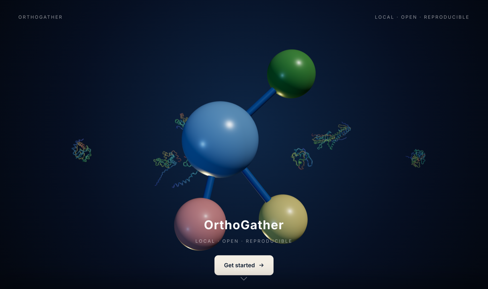
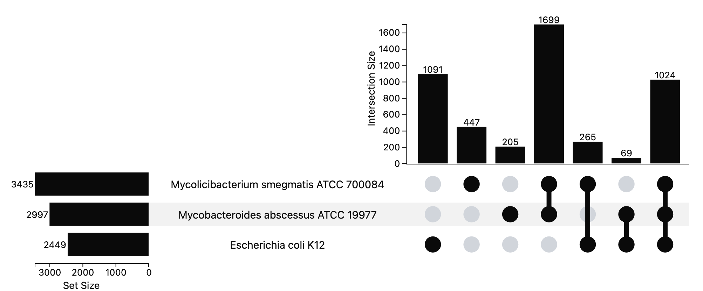

# OrthoGather

[](https://doi.org/10.5281/zenodo.18510910)
[](https://github.com/CarlosVivasR/OrthoGather/releases/latest)


[](LICENSE)

OrthoGather is a locally hosted web application for comparing proteomes across species and for
interpreting experimental protein lists with Gene Ontology (GO) enrichment. It downloads proteomes
from UniProt, runs OrthoFinder to infer orthogroups, shows which orthogroups the selected species
share, and tests GO over-representation. The analyses run on your own computer: only proteome and
taxon identifiers are sent out, to download the data, so your protein lists and results stay with
you.

It was written for researchers working on poorly annotated organisms, such as non-model bacteria,
who want to compare the proteins from an experiment (for example, those that change in abundance
after a treatment) with their counterparts in related species. On macOS and Windows it can be
installed and started without the command line.

**[Installation guide (PDF)](docs/Installation_guide.pdf)** ·
[Worked example](example_analysis/) ·
[Paper (bioRxiv)](https://doi.org/10.64898/2026.01.30.702851) ·
[Help](#getting-help-and-contributing)

<p align="center">
  
</p>

## What it does

- Searches 1,013,422 UniProt proteomes and runs OrthoFinder 2.5.5 locally, or imports existing
  orthogroups.
- Compares orthogroups across species with UpSet plots, optionally only those containing your
  proteins.
- Tests GO enrichment of the proteins you choose against the background you choose.
- Exports figures and tables, records the software and database versions of each run, and keeps a
  history of past runs.

An orthogroup is the set of proteins, from the species analysed, that descend from a single gene
in their last common ancestor, as inferred by OrthoFinder. An UpSet plot shows how many
orthogroups, or proteins, each combination of species shares.

OrthoGather is meant for focused comparisons of up to 50 proteomes available in UniProt; it does not
accept your own FASTA files. GO enrichment needs EBI GOA annotation files, which exist for about 13%
of the proteomes in the catalogue; a species without one keeps its place in the orthogroups but
contributes no annotations. OrthoGather does not transfer annotations between proteins and does not
replace specialised orthology or phylogenetic analyses.

## Installation

Use an installer if you prefer not to type commands; otherwise use Conda, the reference setup. The
[installation guide](docs/Installation_guide.pdf) gives every step, including the security
prompts, with troubleshooting and uninstall instructions; it is also available as a
[web page](https://carlosvivasr.github.io/OrthoGather/INSTALL.html).

### Requirements

- Disk: about 3 GB in total on macOS and 5 GB on Windows, where WSL adds a Linux system, plus the
  proteomes and annotation files you download.
- Memory: 8 GB of RAM or more.
- An internet connection, to download proteomes and GO annotation files and to load the plotting
  libraries, which come from public CDNs.

The six-species example from the paper took under three minutes on an Apple M4, 1 min 47 s of it
in OrthoFinder, with a peak of about 1 GB of memory; download time depends on your connection.

### Installers for macOS and Windows

From the [latest release](https://github.com/CarlosVivasR/OrthoGather/releases/latest), download
`Install-OrthoGather-Mac.zip` or `Install-OrthoGather-Windows.zip`, extract it and double-click
`Install OrthoGather.command` (macOS, Apple Silicon or Intel) or `Install OrthoGather.bat`
(Windows 10 version 2004 or later, or Windows 11). Installation takes about 5–15 minutes.

The installer sets up Conda, Python 3.11, OrthoFinder 2.5.5 and OrthoGather, and adds a launcher
to the Desktop. On Windows it also enables the Windows Subsystem for Linux (WSL), which needs
administrator rights, hardware virtualisation enabled in the BIOS, and one restart. The installers
are not signed, so the first launch shows a security warning; the guide explains how to get past
it. To update later, run the installer again; it keeps your data.

### Conda (macOS, Linux and WSL)

Conda is available from [Miniforge](https://github.com/conda-forge/miniforge); with Micromamba,
replace `conda` with `micromamba`. A plain clone is enough; Git LFS is not needed.

```bash
git clone https://github.com/CarlosVivasR/OrthoGather.git
cd OrthoGather
conda env create -f environment.yml
conda activate orthogather
python app.py
```

`environment.yml` provides Python 3.11, OrthoFinder 2.5.5 and the Python dependencies; the
environment runs natively on Apple Silicon. This is the supported route on Linux. To update, run
`git pull` and `conda env update -f environment.yml --prune` in the project folder.

The installers install the current version from the `main` branch. To install exactly v2.1.0, the
version described in the paper, add `--branch v2.1.0` to the `git clone` command; to move to the
latest version later, run `git checkout main` and `git pull`.

### Checking the installation

Start OrthoGather and choose **Preselected Dataset**. It opens the Protein Analysis tab with
orthogroups computed in advance, so nothing is downloaded; if the figures appear, the application
works. To test OrthoFinder as well, run a New Analysis of two small proteomes, `UP000000807` and
`UP000000808` (*Mycoplasma genitalium* and *M. pneumoniae*, under 700 proteins each).

## Starting an analysis

- **New Analysis**: search the catalogue by scientific or common name, synonym or proteome ID
  (for example `UP000000625`); type `Escherichia coli`, not `E. coli`. Then click
  **Download proteomes** and **Run OrthoFinder**.
- **Preselected Dataset**: orthogroups for 47 proteomes from 35 species associated with cystic
  fibrosis infection and antimicrobial resistance.
- **External Upload**: a `.zip` of the files in an OrthoFinder `Orthogroups` folder, with
  `Orthogroups.tsv` and `Orthogroups.GeneCount.tsv` at the top level, or an OrthoXML file, whose
  hierarchical groups are flattened to top-level orthogroups.

For isolates that are not in UniProt, run OrthoFinder on their predicted proteomes and upload the
result; only proteins with UniProt accessions contribute GO annotations.

## Inputs, operations and outputs

| Step | Input | Operation | Output |
|---|---|---|---|
| New Analysis | UniProt proteomes (up to 50) | Downloads the FASTA files from UniProt and runs OrthoFinder 2.5.5 (orthogroups only) | Orthogroup files, taxonomic tree (Newick), provenance file |
| Preselected Dataset | None | Loads orthogroups computed in advance for 47 proteomes | Orthogroup files |
| External Upload | OrthoFinder `Orthogroups` files (zip) or OrthoXML | Imports the orthogroups | Orthogroup files |
| Protein Analysis | Two or more species; optionally a list of UniProt identifiers | Keeps the orthogroups of the selected species, optionally only those containing the listed proteins, and counts exclusive species combinations | Six figures (PNG, SVG) with data (XLSX, CSV, TSV, JSON); list of identifiers not found |
| Gene Ontology: species match and coverage | The species of the analysis | Matches each species to its EBI GOA file, downloads it and measures annotation coverage per orthogroup | Coverage histogram and summary; coverage workbook (XLSX, CSV, TSV) |
| Gene Ontology: enrichment | Foreground and background UniProt lists, or all proteins of species with GOA files; test settings | Propagates annotations (GOATOOLS), one-sided Fisher's exact test (SciPy), Benjamini–Hochberg correction | Enrichment chart (PNG, SVG), tables (CSV, TSV, JSON) and workbook (XLSX) with a Provenance sheet |
| History and Compare | Saved New Analysis runs | Reopens a run, pre-fills its species to run it again, and compares the orthogroup statistics of two runs | Run records in `~/.orthogather/runs`; comparison view |

## Analyses

### Comparative orthogroup analysis

In the Protein Analysis tab, OrthoGather draws two UpSet plots for the selected species, one counting
orthogroups and one counting proteins; each orthogroup is counted in only one combination of
species. A pasted list of UniProt identifiers, such as the differentially abundant proteins of an
experiment, restricts the plots to the orthogroups that contain them, and identifiers that are not
found are reported.

<p align="center">
  
  <br><sub>Orthogroups shared by <i>M. smegmatis</i>, <i>M. abscessus</i> and <i>E. coli</i> in the worked example.</sub>
</p>

### Gene Ontology enrichment

In the Gene Ontology tab, OrthoGather matches each species to its annotation file in the EBI GOA
database and shows how much of each orthogroup is annotated before any test is run. This coverage
counts every evidence code, so it is an upper bound; the enrichment run reports how many of your
proteins were annotated and tested. Low coverage in your own species means that few of your
proteins can be tested; another species adds annotations only if you expand the sets or use all
GOA files.

You then define a foreground (the proteins of interest) and a background. For a proteomics
experiment, the background should be the proteins detected in that experiment, as in the worked
example; **Use all GOA files** tests instead against the whole annotated proteomes of the selected
species. GOATOOLS reads and propagates the annotations, and OrthoGather applies a one-sided
Fisher's exact test (SciPy) and Benjamini–Hochberg correction. The full settings are described in
[`docs/ADVANCED.md`](docs/ADVANCED.md#enrichment-test).

Two settings need care in poorly annotated species. The evidence-code filter can exclude
electronic (IEA) annotations, which make up 98.3% of the GO annotations available for
*Mycolicibacterium smegmatis* in the worked example; in such species, enriched terms mostly reflect
predicted annotations rather than functions demonstrated in that organism. Expansion, set
separately for the foreground and the background, adds every protein of the orthogroups that
contain your identifiers, paralogues included, from all species with a GOA file; added foreground
proteins are tested only if they are also in the background. No annotation is transferred to any
protein, but some of the annotations counted apply only to the other species. If you expand the
sets, count per orthogroup rather than per protein and check that the enriched terms make sense for
your organism. The provenance sheet does not record expansion or the single-copy filter, so state
them in your methods.

## Reproducing the example in the paper

[`example_analysis/`](example_analysis/) holds the worked example of Supplementary File S1: the
input lists and every file exported by OrthoGather v2.1.0
([10.5281/zenodo.22738813](https://doi.org/10.5281/zenodo.22738813)), the version described in the
paper. Its [README](example_analysis/README.md) gives the steps button by button: a New Analysis
of six UniProt reference proteomes (*M. smegmatis* mc²155, *M. abscessus* ATCC 19977,
*A. baumannii* ATCC 19606, *B. cenocepacia* J2315, *E. coli* K-12 and *P. aeruginosa* PAO1), then
GO enrichment of the 306 proteins decreased and 185 increased in abundance against the 3,181
proteins detected, with the default settings. The expected results are 21 enriched terms and one,
respectively. UniProt and the EBI update their data regularly, so a later run can differ slightly.

## Documentation

- [Installation guide](docs/Installation_guide.pdf) ([web version](https://carlosvivasr.github.io/OrthoGather/INSTALL.html)):
  installers, Conda, troubleshooting and uninstalling.
- [docs/ADVANCED.md](docs/ADVANCED.md): enrichment test settings, OrthoFinder threads, repository
  layout, error codes and tests.
- [example_analysis/README.md](example_analysis/README.md): the worked example, step by step.
- The tutorial inside the application, in the sidebar.
- [CHANGELOG.md](CHANGELOG.md): changes in each version.

## Getting help and contributing

Report problems and suggestions through the
[issue tracker](https://github.com/CarlosVivasR/OrthoGather/issues), using the bug-report or
feature-request form. Include the OrthoGather version, the `ERR_` code of the error message if there
is one, and, for questions about a result, its provenance file. Contributions are welcome; see
[CONTRIBUTING.md](CONTRIBUTING.md).

## Maintenance and testing

OrthoGather is maintained by its authors at University College Dublin. Releases follow
`vMAJOR.MINOR.PATCH` versioning and are listed in the [CHANGELOG](CHANGELOG.md); every release since
1.1.1 is archived on Zenodo. The repository has 101 automated tests (`pytest tests/`), and a GitHub Actions workflow
checks the logic of the Windows installer on Windows.

## Citation

If you use OrthoGather, please cite the preprint:

> Vivas-Rodríguez C, Gomez Matallanas D, Ryan CJ, McClean S, Dennler O, Drabinska J. OrthoGather: a
> local platform for orthology-based proteome comparisons and Gene Ontology enrichment. *bioRxiv*
> (2026). https://doi.org/10.64898/2026.01.30.702851

Please also cite the version you used through Zenodo (v2.1.0:
[10.5281/zenodo.22738813](https://doi.org/10.5281/zenodo.22738813); all versions:
[10.5281/zenodo.18510910](https://doi.org/10.5281/zenodo.18510910)), and the tools and resources
the analysis relies on: OrthoFinder, GOATOOLS, SciPy, the Gene Ontology, EBI GOA and UniProt.

## Licence

OrthoGather is free software, released under the GNU General Public License, version 3 or later
(see [`LICENSE`](LICENSE)). It includes UpSetJS, which its authors release under the GNU AGPL v3 for
academic and private use and under a commercial licence otherwise, and it loads several libraries
from public CDNs. All third-party components and data are listed in
[THIRD_PARTY_LICENSES.md](THIRD_PARTY_LICENSES.md).

## Acknowledgements and funding

OrthoGather was developed at the UCD Conway Institute and the UCD Cancer Data Lab, University
College Dublin, and builds on the tools and resources listed under Citation and in
[THIRD_PARTY_LICENSES.md](THIRD_PARTY_LICENSES.md). The work was supported by the UCD Conway Institute Director's Strategic Awards for Thematic
Research 2023/2024 and by Research Ireland (grants 20/FFP-P/8641 and 20/FFP-P/8717).
